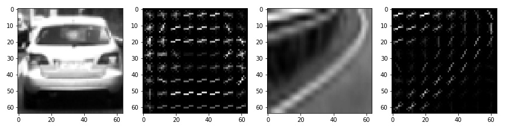
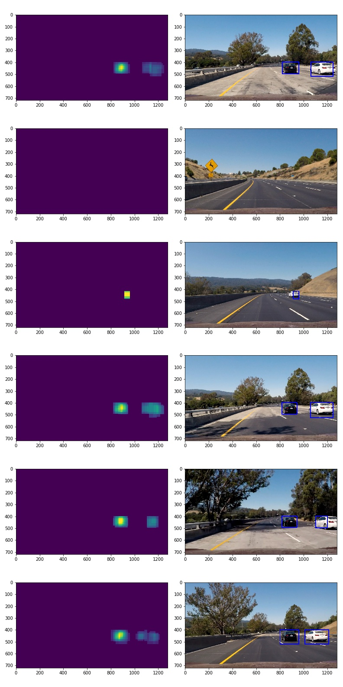

# Vehicle Detection
[](http://www.udacity.com/drive)

### Project Video


### Histogram of Oriented Gradients (HOG) Features
Gradients of pixel intensity are important features for shape detection. I use scikit-image `hog()` function with parameters
```
orientation = 9
pixels_per_cell = 8
cells_per_block = 2
```
The following plots show HOG features of car image and non-car image.



### Build a Classifier
|                  |      channel       |    train accuracy  | test F2-score      |
|:----------------:|:------------------:|:------------------:|:------------------:|
| YCrCb |  ALL | 0.992 | 0.994 |
| YCrCb |  0   | 0.985 | 0.986 |
| YCrCb |  1   | 0.962 | 0.965 |
| YCrCb |  2   | 0.966 | 0.965 |
| YUV   |  ALL | 0.992 | 0.993 |
| YUV   |  0   | 0.984 | 0.985 |
| YUV   |  1   | 0.972 | 0.975 |
| YUV   |  2   | 0.966 | 0.969 |
| HLS   | ALL  | 0.994 | 0.994 |
| HLS   |  0   | 0.967 | 0.970 |
| HLS   |  1   | 0.986 | 0.987 |
| HLS   |  2   | 0.965 | 0.965 |
| LUV   |  ALL | 0.992 | 0.994 |
| LUV   |  0   | 0.984 | 0.986 |
| LUV   |  1   | 0.974 | 0.978 |
| LUV   |  2   | 0.967 | 0.965 |
| HSV   |  ALL | 0.992 | 0.993 |
| HSV   |  0   | 0.970 | 0.973 |
| HSV   |  1   | 0.970 | 0.971 |
| HSV   |  2   | 0.987 | 0.987 |
| RGB   | ALL  | 0.983 | 0.984 |
| RGB   |  0   | 0.975 | 0.976 |
| RGB   |  1   | 0.981 | 0.983 |
| RGB   |  2   | 0.981 | 0.981 |



