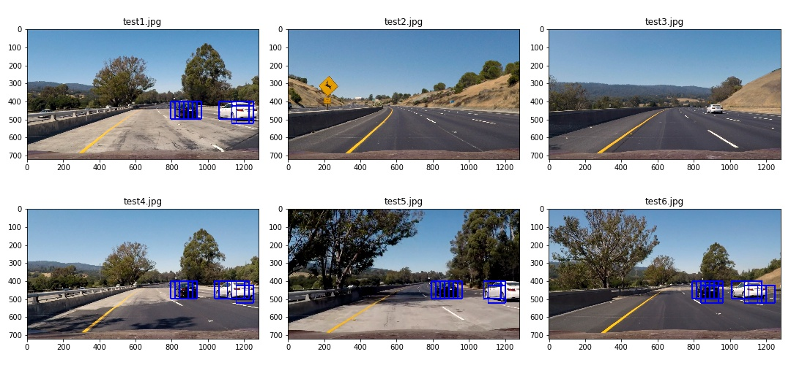

# Vehicle Detection
[](http://www.udacity.com/drive)

### Project Video


### Histogram of Oriented Gradients (HOG) Features
Gradients of pixel intensity are important features of shape. I use scikit-image `hog()` function with parameters
```
orientation = 9
pixels_per_cell = 8
cells_per_block = 2
```
The following plots show HOG features of car image and non-car image.


### Histogram of Colors
Color is another features to detect cars. I use `np.histogram()` with 32 bins and range = (0, 256), and the image is resized to 32 x 32.

### Build a Classifier
```
vehicle images: 8792
non-vehicle images: 8968
```
80% of (vehicle images + non-vehicle images) are used for training and 20% for testing. `sklearn.svm.LinearSVC` is used as classifier. HOG and HOC features are combined, I try different color spaces: `RGB, HSV, LUV, HLS, YUV, YCrCb` and different HOG channel. From the following table, I find that training with all HOG channel always produces better accuracy than using single HOG channel for a fixed color space. 


|                  |      channel       |    train accuracy  | test F2-score      |
|:----------------:|:------------------:|:------------------:|:------------------:|
| YCrCb |  ALL | 0.992 | 0.994 |
| YCrCb |  0   | 0.985 | 0.986 |
| YCrCb |  1   | 0.962 | 0.965 |
| YCrCb |  2   | 0.966 | 0.965 |
| YUV   |  ALL | 0.992 | 0.993 |
| YUV   |  0   | 0.984 | 0.985 |
| YUV   |  1   | 0.972 | 0.975 |
| YUV   |  2   | 0.966 | 0.969 |
| HLS   | ALL  | 0.994 | 0.994 |
| HLS   |  0   | 0.967 | 0.970 |
| HLS   |  1   | 0.986 | 0.987 |
| HLS   |  2   | 0.965 | 0.965 |
| LUV   |  ALL | 0.992 | 0.994 |
| LUV   |  0   | 0.984 | 0.986 |
| LUV   |  1   | 0.974 | 0.978 |
| LUV   |  2   | 0.967 | 0.965 |
| HSV   |  ALL | 0.992 | 0.993 |
| HSV   |  0   | 0.970 | 0.973 |
| HSV   |  1   | 0.970 | 0.971 |
| HSV   |  2   | 0.987 | 0.987 |
| RGB   | ALL  | 0.983 | 0.984 |
| RGB   |  0   | 0.975 | 0.976 |
| RGB   |  1   | 0.981 | 0.983 |
| RGB   |  2   | 0.981 | 0.981 |

The parameters used for car detection are
```
classifier: LinearSVC
C = 1
penalty: L2
color space: YCrCb
HOG channel: ALL
scale = 1.5
```

### Sliding Window Search
Apply the classifier on images to perform a sliding window search, each search is specified in a region of interest (i.e 96 x 96), implemented in `find_cars(img, ystart, ystop, scale)`. Test search on the testing-images, see the following



### 

